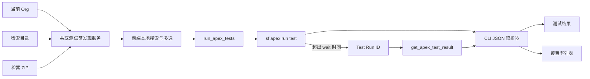

# Apex Test Runner 实现计划与 Agent 交接文档

> 文档状态：待实施  
> 编写日期：2026-08-18  
> 适用仓库：SF-DevKit  
> 目标版本：MVP

---

## 1. 交接目标

在 SF-DevKit 中新增独立的「Apex 测试」功能模块，完成以下两条核心链路：

1. 从当前 Org 中准确加载并快速搜索 Apex 测试类，支持多选运行，并展示测试结果及本次运行触达类/Trigger 的覆盖率。
2. 与 Metadata Browser 已有检索功能衔接，自动解析最近下载的目录或 ZIP 包中的测试类，并可直接运行。

实施 Agent 开始前必须先阅读仓库根目录的 `AGENTS.md`，遵循现有 Tauri、React、Zustand、TanStack Query、i18n 和 `sf` CLI 调用方式。

完成定义：本文件第 13 节中的验收项全部通过，并执行第 12 节中的验证命令。

---

## 2. MVP 范围

### 2.1 必须实现

| 功能 | 要求 |
|---|---|
| 独立模块 | 侧边栏新增「Apex 测试」模块，建议放在 Apex Runner 后面 |
| Org 测试类 | 从当前 Org 获取真实测试类，不能只根据类名是否包含 `Test` 判断 |
| 快速搜索 | 类列表加载后在前端本地过滤，输入时不重复调用 CLI |
| 多选运行 | 支持单选、多选、全选当前搜索结果、清空选择 |
| 检索包解析 | 支持最近检索产生的目录和 ZIP 文件 |
| 测试识别 | 支持 `@isTest`、`@IsTest(...)` 和旧式 `testMethod` |
| 测试结果 | 展示类、方法、Outcome、耗时、错误消息、Stack Trace |
| 覆盖率 | 展示本次运行触达的 ApexClass/ApexTrigger 覆盖率，可按名称搜索 |
| 覆盖率排序 | 默认覆盖率从低到高，优先暴露低覆盖类 |
| 检索入口 | Metadata Browser 检索成功后提供「解析并运行测试」按钮 |
| 中英文 | 所有用户可见文本写入 `zh-CN` 和 `en-US` locale |

### 2.2 明确不做

- Apex Test Suite 选择。
- 测试方法级选择；MVP 只选择测试类。
- RunLocalTests / RunAllTestsInOrg 入口。
- 测试运行历史、数据库持久化和趋势图。
- 源码编辑器中的逐行覆盖着色。
- JUnit、TAP、CSV 或 HTML 导出。
- 同时对多个 Org 运行。
- 真正取消已经提交到 Salesforce 的异步测试作业。
- 自动部署或修改检索包内容。

---

## 3. 已有能力与需要修正的问题

### 3.1 可直接复用

- `src/store/workspace.ts`
  - 已持久化 `lastRetrieveDir`、`lastRetrieveOrgId`、`lastRetrieveAt`。
  - Metadata Browser 检索成功后已经写入最新输出路径。
- `src-tauri/src/deployer/test_search.rs`
  - 已有 ApexClass 的 10 分钟 SQLite 缓存模式。
  - 已有递归扫描 `.cls` 文件的基础代码。
- `src/modules/Deployer/DeployConfig.tsx`
  - 已有测试类搜索、多选标签和防抖交互，可参考但不要直接复制状态实现。
- `src-tauri/src/cli/runner.rs`
  - 已处理 `sf` CLI 路径发现、GUI 应用 PATH、JSON 模式和 stdout/stderr 捕获。
- `src/modules/MetadataBrowser/RetrievePanel.tsx`
  - 已能获得检索结果的实际目录或 ZIP 路径。

### 3.2 当前问题

当前 `search_apex_test_classes` 实际通过 `sf org list metadata --metadata-type ApexClass` 获取所有 ApexClass，无法判断类是否为测试类。Deployer 前端的“仅测试类”又只是使用：

```ts
cls.name.includes("Test")
```

这会产生两类错误：

- 漏掉名称不含 `Test` 的真实测试类。
- 把名称含 `Test` 的普通类误判为测试类。

本次实施必须将测试类发现抽取成共享能力，并让 Deployer 与新模块共同使用准确结果。

---

## 4. 产品与交互设计

### 4.1 页面布局

```text
┌──────────────── Apex 测试 ────────────────────────────────┐
│ 来源：[当前 Org] [最近检索包]   当前运行 Org：dev-org      │
│ 包路径：.../retrieve-xxx.zip  [选择其他包] [重新解析]      │
├──────────────────────┬─────────────────────────────────────┤
│ 测试类               │ 运行结果                            │
│ [搜索测试类……]       │ 通过 18  失败 1  跳过 0  覆盖率 82% │
│ □ AccountServiceTest │                                     │
│ ☑ OrderServiceSpec   │ [测试结果] [代码覆盖率]             │
│ ☑ PriceEngineTest    │                                     │
│                      │ [搜索覆盖类……]                      │
│ 已选择 2 个          │ AccountService        91%           │
│ [全选结果] [清空]    │ OrderService          73%           │
│ [运行所选测试]       │                                     │
└──────────────────────┴─────────────────────────────────────┘
```

### 4.2 来源切换

#### 当前 Org

- 当前 Org 改变时重新加载对应测试类。
- 首次查询通过 Rust/CLI 获取并写入 SQLite 缓存。
- 后续 10 分钟内读取缓存。
- 提供显式刷新按钮，刷新时忽略 TTL。
- 数据加载完成后，搜索只在前端执行。

#### 最近检索包

- 默认读取 `useWorkspaceStore.lastRetrieveDir`。
- 支持路径为目录或 `.zip` 文件。
- 提供“选择其他目录或 ZIP”入口。
- 解析完成后默认勾选包内全部测试类，用户可取消部分选择。
- 若包来源 Org 与当前 Org 不一致，显示警告但不阻止运行；最终运行目标始终是 TopBar 中的当前 Org。
- 包内无测试类时显示明确空状态，并提示在 Metadata Browser 中检索 ApexClass。

### 4.3 搜索与选择

- 类搜索：忽略大小写，匹配 `name` 和可选 namespace。
- 搜索结果由 `useMemo` 本地计算，不在每次输入时调用后端。
- “全选当前结果”只选择当前过滤后可见项。
- 已选择类在切换搜索词后仍保留。
- 来源改变时清空旧选择，并在新来源加载成功后按以下规则处理：
  - Org 来源：默认不选择。
  - 检索包来源：默认全选解析结果。
- 禁止提交空选择。

### 4.4 运行状态

- 运行期间禁用来源切换、选择操作和重复运行按钮。
- 显示运行中状态、已选类数和开始时间。
- `sf apex run test --wait 10` 在等待窗口内未完成时，保存并展示 Test Run ID。
- Pending 状态提供“获取最新结果”按钮，通过 `sf apex get test` 继续等待/获取结果。
- 不提供“取消 Org 测试”按钮，避免让用户误以为终止本地 CLI 就等于取消 Salesforce 中的测试作业。

### 4.5 结果展示

#### 汇总

- Outcome。
- Tests Ran、Passing、Failing、Skipped。
- Test Execution Time。
- Test Run Coverage。
- Org Wide Coverage。
- Test Run ID。

#### 测试结果 Tab

- 默认失败项在前，其余按 `Class.Method` 排序。
- 列：测试类、方法、结果、耗时。
- 失败行可展开 Message 和 StackTrace。
- 提供名称搜索；可选增加“全部/失败”轻量筛选，不增加更多筛选器。

#### 代码覆盖率 Tab

- 仅展示本次运行触达的 ApexClass/ApexTrigger，这是 Salesforce CLI 返回数据的实际语义。
- 列：名称、覆盖率、已覆盖/总行、未覆盖行。
- 默认覆盖率升序。
- 名称搜索在前端完成。
- 0 总行数时覆盖率显示 `—`，不得出现 `NaN`。
- 未覆盖行号默认折叠，点击行后展开。

---

## 5. 技术方案总览



### 5.1 新增后端模块

建议结构：

```text
src-tauri/src/
  apex_test/
    mod.rs
    discovery.rs       # Org、目录、ZIP 测试类发现
    models.rs          # Rust DTO
    result_parser.rs   # sf CLI JSON 解析
    runner.rs          # run/get test 命令编排
  commands/
    apex_test.rs       # Tauri command 薄封装
```

### 5.2 新增前端模块

建议结构：

```text
src/modules/ApexTestRunner/
  index.tsx
  TestClassPicker.tsx
  TestRunSummary.tsx
  TestResultsTable.tsx
  CoverageTable.tsx
  filters.ts
  filters.test.ts
  store.ts             # 仅保存跨模块导入意图，不持久化运行结果
  types.ts
```

避免把所有 JSX、类型和筛选逻辑集中在 `index.tsx`。

---

## 6. 数据契约

Rust 返回字段建议统一使用 `snake_case`，与项目现有 Tauri 返回模型保持一致。TypeScript 类型按实际 wire format 定义，不在 UI 中散落 `any`。

### 6.1 测试类

```rust
#[derive(Debug, Clone, Serialize, Deserialize)]
pub struct ApexTestClass {
    pub id: Option<String>,
    pub name: String,
    pub namespace_prefix: Option<String>,
    pub source: String,          // "org" | "retrieve"
    pub file_path: Option<String>,
}
```

### 6.2 测试汇总

```rust
#[derive(Debug, Clone, Serialize, Deserialize)]
pub struct ApexTestSummary {
    pub outcome: String,
    pub tests_ran: u32,
    pub passing: u32,
    pub failing: u32,
    pub skipped: u32,
    pub test_execution_time_ms: u64,
    pub test_run_coverage: Option<f64>,
    pub org_wide_coverage: Option<f64>,
}
```

### 6.3 方法结果

```rust
#[derive(Debug, Clone, Serialize, Deserialize)]
pub struct ApexTestMethodResult {
    pub id: Option<String>,
    pub class_name: String,
    pub namespace_prefix: Option<String>,
    pub method_name: String,
    pub outcome: String,
    pub run_time_ms: u64,
    pub message: Option<String>,
    pub stack_trace: Option<String>,
}
```

### 6.4 覆盖率

```rust
#[derive(Debug, Clone, Serialize, Deserialize)]
pub struct ApexCoverageResult {
    pub id: String,
    pub name: String,
    pub covered_percent: Option<f64>,
    pub total_lines: u32,
    pub covered_lines: u32,
    pub uncovered_lines: Vec<u32>,
}
```

注意：Salesforce CLI JSON 中 `coverage.coverage[].lines` 是以行号为 key、`1/0` 为值的对象。Rust 解析器应将其标准化为 `uncovered_lines: Vec<u32>`，不要把动态 key 对象直接传给前端。

### 6.5 顶层结果

```rust
#[derive(Debug, Clone, Serialize, Deserialize)]
pub struct ApexTestRunResult {
    pub status: String,          // "completed" | "pending"
    pub test_run_id: String,
    pub summary: Option<ApexTestSummary>,
    pub tests: Vec<ApexTestMethodResult>,
    pub coverage: Vec<ApexCoverageResult>,
    pub raw_stdout: String,
}
```

`raw_stdout` 用于 CLI 版本变化时诊断，但 UI 默认不展示；需要时可放在折叠的“原始结果”区域。

---

## 7. Rust 后端实施

### 7.1 测试类识别函数

在 `discovery.rs` 中创建唯一共享判断函数，例如：

```rust
pub fn is_apex_test_class(body: &str) -> bool
```

最低要求：

- 大小写不敏感匹配 `@isTest`，允许 `@isTest(SeeAllData=true)`。
- 匹配旧式 `testMethod` 关键字。
- 先去除 `// ...` 和 `/* ... */` 注释，避免仅在注释中出现 `@isTest` 时误判。
- 使用单词边界，不能把普通标识符中的 `testMethod` 子串算作测试。
- 空 Body 返回 false。

不要再使用“文件名包含 Test”作为判定条件。文件名只能用于显示名称。

### 7.2 从 Org 获取测试类

通过现有 `cli::runner::run_command` 执行：

```sh
sf data query \
  --use-tooling-api \
  --query "SELECT Id, Name, NamespacePrefix, Body FROM ApexClass ORDER BY Name" \
  --target-org <org> \
  --json
```

实现注意：

- `run_command(args, true)` 已自动追加 `--json`，新代码的 `args` 不要再次添加 `--json`。
- 解析 `result.records`。
- 对每条记录调用 `is_apex_test_class`。
- Body 为空或不可读的类默认排除。
- 按 `namespace_prefix + name` 排序并去重。
- 查询失败时返回包含 stderr 或 CLI JSON error message 的可读错误。

### 7.3 SQLite 缓存

继续使用现有 `apex_class_cache`，避免新增重复缓存表。通过迁移增加：

```sql
ALTER TABLE apex_class_cache ADD COLUMN namespace_prefix TEXT;
ALTER TABLE apex_class_cache ADD COLUMN is_test INTEGER NOT NULL DEFAULT 0;
```

要求：

- 保持 10 分钟 TTL。
- 缓存刷新时使用事务：先获取并解析远端结果，再替换旧缓存，避免 CLI 失败后把可用缓存清空。
- `force_refresh = true` 时忽略 TTL。
- `list_apex_test_classes` 只返回 `is_test = 1`。
- 修改现有 Deployer 的 `search_apex_test_classes`，让它查询相同的准确测试类缓存。
- 对旧数据库的重复列错误保持现有迁移容错风格。

### 7.4 目录扫描

目录扫描要求：

- 递归查找 `.cls`，扩展名比较忽略大小写。
- 忽略 `.git`、`node_modules` 和隐藏缓存目录。
- 读取失败的单个文件跳过，但不能导致整个目录扫描失败。
- 使用 `is_apex_test_class` 判断。
- `name` 取文件 stem。
- 使用规范化路径去重，最终再按 `namespace + name` 去重。
- 返回 `file_path` 便于 UI 显示来源。

### 7.5 ZIP 扫描

在 `src-tauri/Cargo.toml` 增加 Rust `zip` crate，直接读取 archive entry，不要调用系统 `unzip`，也不要先整体解压到磁盘。

安全和稳定性要求：

- 只读取文件名以 `.cls` 结尾的 entry。
- 忽略目录 entry。
- 单个 `.cls` 大小设置合理上限，例如 2 MiB。
- 所有待读取 `.cls` 总大小设置合理上限，例如 50 MiB。
- 无效 ZIP 返回明确错误，不得 panic。
- ZIP 内路径只用于显示，不写入文件系统，避免 Zip Slip。
- 目录与 ZIP 复用同一个 `is_apex_test_class`。

### 7.6 运行测试

新增：

```rust
pub async fn run_apex_tests(
    org_id: &str,
    class_names: &[String],
) -> anyhow::Result<ApexTestRunResult>
```

构建参数：

```sh
sf apex run test \
  --tests ClassA \
  --tests ClassB \
  --code-coverage \
  --result-format json \
  --wait 10 \
  --target-org <org> \
  --json
```

要求：

- 使用 `tokio::process::Command` 的参数数组，不拼接 shell 字符串。
- 每个类名重复一个 `--tests` 参数。
- 校验选择非空。
- 限制单次最多 200 个类，超出时给出明确错误。
- 类名允许普通名称和 `namespace.ClassName`，拒绝空白及明显非法字符。
- CLI 退出码非 0 时仍优先尝试解析 stdout。测试方法失败可能仍包含完整可展示结果，不能一概作为传输错误丢弃。
- 只有 stdout 不含有效测试结果时，才组合 CLI error、stderr 和 exit code 返回错误。

Salesforce CLI 命令参考：

- <https://developer.salesforce.com/docs/platform/salesforce-cli-reference/guide/cli_reference_apex_run_test.html>

### 7.7 Pending 结果

如果 `run test --wait 10` 返回 Test Run ID 而没有最终结果，返回：

```json
{
  "status": "pending",
  "test_run_id": "707...",
  "summary": null,
  "tests": [],
  "coverage": []
}
```

新增：

```rust
pub async fn get_apex_test_result(
    org_id: &str,
    test_run_id: &str,
) -> anyhow::Result<ApexTestRunResult>
```

调用：

```sh
sf apex get test \
  --test-run-id <id> \
  --code-coverage \
  --result-format json \
  --target-org <org> \
  --json
```

验证 Test Run ID 只包含 Salesforce ID 允许字符，禁止把任意文本传给 CLI。

### 7.8 JSON 解析器

解析器必须独立成纯函数，以便使用 fixture 单测：

```rust
pub fn parse_apex_test_output(stdout: &str) -> anyhow::Result<ApexTestRunResult>
```

兼容至少以下情况：

- 标准 `{ status, result: { summary, tests, coverage } }` envelope。
- `result.coverage` 不存在。
- `coverage.coverage` 为空。
- 测试失败但结果结构完整。
- Pending 结果只有 Test Run ID。
- 可选数字或百分比以字符串返回。
- `Message`、`StackTrace`、namespace 为 null。
- 未知字段应忽略。

不要在 React 层解析 Salesforce CLI 原始 JSON。

### 7.9 Tauri Commands

新增四个命令：

```rust
list_apex_test_classes(org_id, force_refresh)
scan_apex_test_package(path)
run_apex_tests(org_id, class_names)
get_apex_test_result(org_id, test_run_id)
```

注册位置：

- `src-tauri/src/commands/mod.rs`
- `src-tauri/src/lib.rs`
- `src-tauri/src/apex_test/mod.rs`
- `src-tauri/src/lib.rs` 顶层 module 声明

Command 文件只做参数接收、调用 service 和错误字符串转换，不放业务解析逻辑。

---

## 8. React 前端实施

### 8.1 模块注册

修改：

- `src/store/ui.ts`
  - `ModuleId` 增加 `"apex_tests"`。
- `src/App.tsx`
  - 导入并注册 `ApexTestRunner`。
  - 放在 `apex` 后面。
  - 更新快捷键注释，实际逻辑已按 registry 长度工作。
- `src/components/Layout/SidebarIcons.tsx`
  - 新增测试/对勾风格图标。
  - 不允许新模块落入当前默认的 Log 图标分支。
- `src/i18n/locales/zh-CN.json`
  - `modules.apexTests = "Apex 测试"`。
- `src/i18n/locales/en-US.json`
  - `modules.apexTests = "Apex Tests"`。

### 8.2 Tauri API 封装

在 `src/lib/tauri.ts` 增加完整类型与方法：

```ts
listApexTestClasses(payload)
scanApexTestPackage(path)
runApexTests(payload)
getApexTestResult(payload)
```

页面组件统一调用 `tauriApi`，不要混用新的裸 `invoke()`。

### 8.3 React Query

Org 测试类建议使用：

```ts
["apex-test-classes", currentOrg]
```

要求：

- `enabled` 同时依赖当前 Org 和当前激活模块，避免应用启动时无意义加载 Body。
- 显式刷新调用 `forceRefresh: true` 后再更新该 query 数据。
- 检索包扫描可用 mutation，因为它由路径变化或用户操作触发。
- 测试运行和结果获取分别使用 mutation。

### 8.4 跨模块检索入口

新增轻量 `src/modules/ApexTestRunner/store.ts`，只负责跨模块意图：

```ts
interface ApexTestRunnerNavState {
  sourceMode: "org" | "retrieve";
  packagePath: string | null;
  openRetrievePackage: (path: string) => void;
  setSourceMode: (mode: "org" | "retrieve") => void;
}
```

该 store 不需要 persist，也不保存运行结果。

在 Metadata Browser 检索成功 banner 中增加按钮：

```ts
useApexTestRunnerStore.getState().openRetrievePackage(result.output_path)
useUiStore.getState().setActiveModule("apex_tests")
```

同时保留现有 `useWorkspaceStore.setLastRetrieve`，Deployer 仍依赖它。

### 8.5 页面本地状态

以下状态保留在 `ApexTestRunner/index.tsx`：

- `selectedClassKeys: Set<string>`。
- `classSearch`。
- `resultSearch`。
- `coverageSearch`。
- `activeResultTab`。
- `runResult`。
- `runError`。

不要将 React `Set` 直接存入持久化 Zustand。

类唯一 key 建议：

```ts
`${namespace_prefix ?? ""}:${name}`
```

运行参数使用带 namespace 的完整类名。

### 8.6 结果辅助函数

将下列逻辑放入 `filters.ts` 并单测：

- 类搜索标准化。
- 测试类过滤。
- 覆盖率过滤与升序排序。
- 测试结果“失败优先”排序。
- 覆盖率格式化和 0 行保护。
- namespace 与 class name 的完整名称拼接。

### 8.7 样式

在 `src/styles.css` 增加独立 `apex-test-*` 前缀，避免复用 Deployer 的结构 class 后产生耦合。

需要覆盖：

- 双栏布局。
- 小窗口下单栏堆叠。
- 运行汇总卡。
- Outcome badge。
- 覆盖率条。
- 可展开失败详情。
- 空状态、错误状态、loading skeleton/spinner。
- light/dark theme。

不要引入新的 UI 组件库。

---

## 9. i18n 文案范围

建议新增顶层 `apexTestRunner`，至少包含：

```text
title
source.org
source.retrieve
searchClasses
searchResults
searchCoverage
refresh
choosePackage
parsePackage
selectVisible
clearSelection
selectedCount
runSelected
running
fetchResult
pending
tabs.tests
tabs.coverage
summary.*
columns.*
empty.noOrg
empty.noClasses
empty.noPackageTests
errors.*
warnings.orgMismatch
```

不得在 JSX 或 Rust 返回的 UI 逻辑中新增硬编码中英文。Rust 只返回技术错误，前端对可预期状态使用 i18n 文案。

---

## 10. 测试计划

### 10.1 Rust 单元测试

#### 测试类识别

- `@isTest private class Foo`。
- `@IsTest(SeeAllData=true)`。
- 旧式 `static testMethod void testOne()`。
- 大小写变化。
- `@isTest` 只存在于单行注释中。
- `@isTest` 只存在于块注释中。
- 普通类名包含 `Test`，Body 不含测试标记。
- 空 Body。

#### 包扫描

- SFDX 目录结构。
- Metadata API 目录结构。
- ZIP 包。
- 重复类名去重。
- 无测试类。
- 损坏 ZIP。
- 超过 entry 大小限制。

#### CLI JSON 解析

建议在 `src-tauri/src/apex_test/fixtures/` 添加脱敏 fixture：

- `passed-with-coverage.json`。
- `failed-with-stack.json`。
- `pending.json`。
- `completed-no-coverage.json`。
- `malformed.json`。

验证 summary、PascalCase test 字段、coverage lines 转换、null 值和错误消息。

### 10.2 前端 Vitest

至少覆盖：

- 测试类搜索忽略大小写。
- namespace 搜索。
- 全选当前可见结果。
- 已选择项在搜索变化后保持。
- 覆盖率从低到高。
- `total_lines = 0` 不产生 `NaN`。
- 失败测试排在通过测试之前。

### 10.3 手工集成验证

使用 sandbox 或 scratch org 验证：

1. 当前 Org 加载真实测试类。
2. 运行一个通过的测试类。
3. 运行一个包含失败方法的测试类。
4. 验证覆盖率搜索和未覆盖行。
5. Metadata Browser 以 extract 模式检索 ApexClass，再跳转运行。
6. Metadata Browser 以 zip 模式检索 ApexClass，再跳转运行。
7. 包中没有测试类。
8. 检索来源 Org 与当前 Org 不一致。
9. 当前 Org 缺少所选类。
10. CLI 返回 Pending Test Run ID 后重新获取结果。

不要在生产 Org 中执行实施验证。

---

## 11. 推荐实施顺序

### Phase 1：共享发现能力

- [ ] 创建 `apex_test` Rust 模块和 DTO。
- [ ] 先编写 `is_apex_test_class` 单测。
- [ ] 实现注释清理和测试标记识别。
- [ ] 实现目录扫描测试及代码。
- [ ] 增加 ZIP fixture、依赖和扫描实现。
- [ ] 实现 Org Body 查询。
- [ ] 扩展 SQLite cache，保证失败不清空旧缓存。
- [ ] 让 Deployer 使用准确测试类结果。
- [ ] 运行 Rust 测试和现有前端测试。

### Phase 2：测试运行与解析

- [ ] 先添加 CLI JSON fixture 和解析测试。
- [ ] 实现 `result_parser.rs`。
- [ ] 实现 `run_apex_tests`。
- [ ] 实现 Pending 识别。
- [ ] 实现 `get_apex_test_result`。
- [ ] 注册并调用四个 Tauri commands。
- [ ] 对通过、失败、无覆盖率和 Pending 做一次 sandbox 验证。

### Phase 3：前端模块

- [ ] 注册 `apex_tests` 模块和图标。
- [ ] 增加 tauriApi 类型与方法。
- [ ] 实现来源切换和类选择。
- [ ] 实现本地搜索和选择辅助函数测试。
- [ ] 实现运行状态和 Pending 状态。
- [ ] 实现汇总、测试结果和覆盖率 Tab。
- [ ] 增加 light/dark 和响应式样式。
- [ ] 补齐中英文文案。

### Phase 4：Metadata Browser 集成与收尾

- [ ] 检索成功 banner 增加跳转按钮。
- [ ] 验证 extract 输出。
- [ ] 验证 ZIP 输出。
- [ ] 验证 Org mismatch 提示。
- [ ] 执行完整测试、构建和格式检查。
- [ ] 更新本文件的实施状态或新增 changelog 说明。

每个 Phase 完成后都应保持项目可构建，不要把所有验证推迟到最后。

---

## 12. 验证命令

```sh
# 前端单元测试
npm test

# TypeScript 类型检查 + Vite 生产构建
npm run build

# Rust 单元测试
cargo test --manifest-path src-tauri/Cargo.toml

# Rust 编译检查
cargo check --manifest-path src-tauri/Cargo.toml

# 完整桌面开发验证
npm run tauri dev
```

如果全量测试存在与本功能无关的既有失败，交接报告必须明确：失败命令、失败用例、是否可在变更前复现。不得静默忽略。

---

## 13. 验收标准

### 13.1 Org 类选择

- [ ] 当前 Org 有测试类时能完整加载。
- [ ] 名称不含 `Test` 的 `@isTest` 类能出现。
- [ ] 名称含 `Test` 的普通类不会出现。
- [ ] 搜索输入后立即本地过滤，无逐字符 CLI 请求。
- [ ] 可以多选、全选当前结果和清空。

### 13.2 检索包

- [ ] 最近一次 extract 检索目录能被自动解析。
- [ ] 最近一次 ZIP 检索文件能被自动解析。
- [ ] 检索成功后可一键跳转到 Apex 测试模块。
- [ ] 包内测试类默认全选。
- [ ] 无测试类、损坏 ZIP 和路径不存在均有明确提示。

### 13.3 测试运行

- [ ] 空选择不能运行。
- [ ] 运行目标明确为当前 Org。
- [ ] 能运行一个或多个选定测试类。
- [ ] 运行期间不能重复提交。
- [ ] 测试失败作为结构化结果展示，不被误报为普通 CLI 崩溃。
- [ ] Pending 时显示 Test Run ID 并能继续获取结果。

### 13.4 结果与覆盖率

- [ ] 汇总数字与 CLI JSON 一致。
- [ ] 失败方法展示 Message 和 StackTrace。
- [ ] 覆盖率按低到高排序。
- [ ] 覆盖类可快速搜索。
- [ ] 能查看未覆盖行号。
- [ ] 0 行或无覆盖数据时界面正常，无 `NaN`。

### 13.5 回归与质量

- [ ] Deployer 的 RunSpecifiedTests 搜索仍可使用且结果更准确。
- [ ] Metadata Browser 原有检索、打开目录和工作区传递不受影响。
- [ ] `npm test` 通过。
- [ ] `npm run build` 通过。
- [ ] `cargo test` 通过。
- [ ] `cargo check` 通过。
- [ ] 中文和英文界面均无缺失 key。

---

## 14. 风险与处理

| 风险 | 处理方式 |
|---|---|
| 首次查询所有 ApexClass Body 较慢 | 仅模块激活时加载，SQLite 缓存 10 分钟，提供手动刷新 |
| Managed Package Body 不可见 | Body 为空时不判断为可选本地测试类；MVP 不做 RunAllTestsInOrg |
| CLI JSON 字段随版本变化 | 独立 parser、宽松可选字段、fixture 测试、保留 raw stdout |
| 测试失败导致 CLI 非 0 | 先解析 stdout 中的结构化结果，再判断是否为命令错误 |
| 长时间运行 | `--wait 10` 后返回 Pending，由用户点击获取结果 |
| ZIP 过大或恶意 entry | 不落盘、限制单文件和总读取大小、只读取 `.cls` |
| 当前 Org 与检索 Org 不同 | 显示警告；运行目标始终明确显示为当前 Org |
| 缓存刷新失败 | 成功获取新数据后再事务替换，保留旧缓存 |

---

## 15. 最终交接报告要求

实施 Agent 完成后应报告：

1. 已实现的功能摘要。
2. 实际修改/新增的文件清单。
3. 与本计划不同的设计决定及原因。
4. 执行过的测试命令和结果。
5. 尚未解决的问题或已知限制。
6. 手工验证使用的 Org 类型，不记录用户名、Token 或其他敏感信息。

不要提交认证信息、真实 Org 数据、完整 CLI 原始输出或用户本地绝对路径到测试 fixture。
