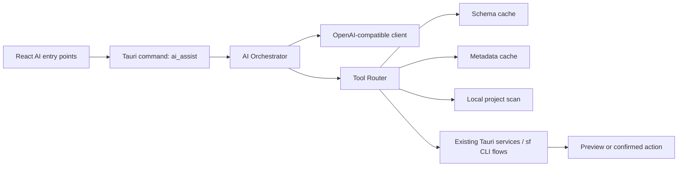
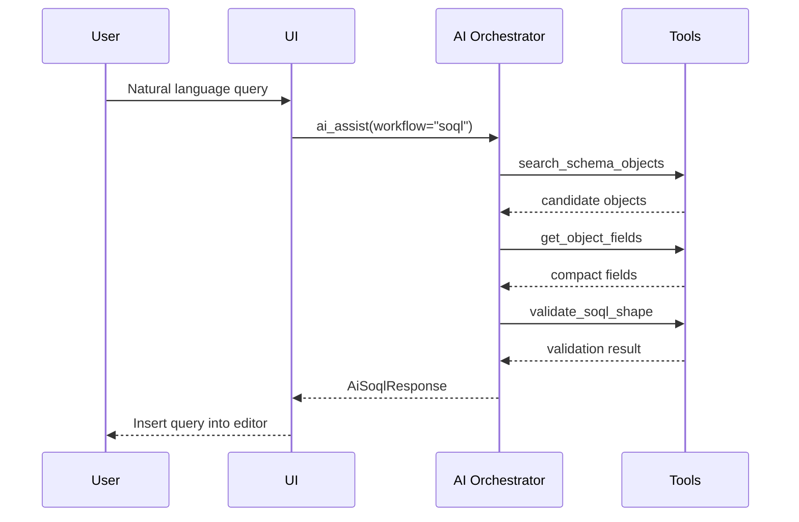
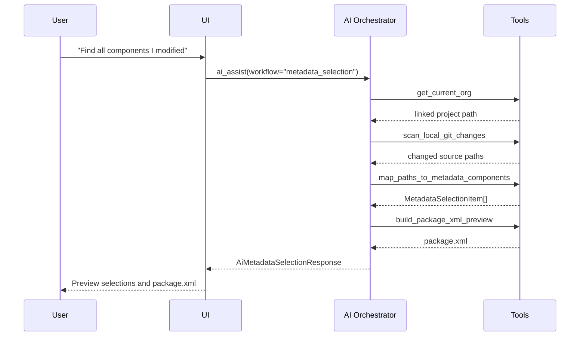

# SF DevKit AI Framework And Tool Calling Design

## Background

SF DevKit is a Tauri desktop application for Salesforce developers. The current architecture has a clear and useful boundary:

- Frontend features are implemented as React modules.
- Backend capabilities are exposed as Tauri commands.
- Salesforce access goes through the `sf` CLI.
- Schema, metadata, retrieve history, and related state are cached in SQLite.

The AI feature should preserve this boundary. The model should not directly access Salesforce, execute shell commands, or mutate local files. Instead, it should translate natural language into structured intent, call approved local tools, and return a preview or plan that the user can confirm.

## Goals

- Add a reusable AI framework that can support multiple product features.
- Support natural language to SOQL generation.
- Support natural language to metadata component selection.
- Support local project change discovery, such as "find all components I modified".
- Keep all Salesforce operations inside existing Rust/Tauri and `sf` CLI flows.
- Make AI actions inspectable and confirmable before executing side-effecting operations.
- Allow OpenAI-compatible providers through configurable base URL, API key, and model.
- Report progress while the AI orchestrator is searching schema, calling tools, or validating output.
- Localize AI-facing UI text and model-generated explanations according to the current app locale.

## Non-Goals

- Do not build a general autonomous agent that can run arbitrary commands.
- Do not let the model call the `sf` CLI directly.
- Do not automatically run generated SOQL, retrieve metadata, deploy metadata, or open external tools without user confirmation.
- Do not introduce a heavy agent framework before the app has concrete AI workflows.
- Do not replace existing Monaco completion, metadata browser, retrieve, deploy, or diff flows.
- Do not support persistent multi-turn conversation memory in V1. Each request is single-turn, although the frontend may pass the current editor text or current metadata selection as explicit context.
- Do not send local file contents to the model for "find my changes" workflows. V1 sends paths, git statuses, and inferred metadata identity only.

## Recommended Product Shape

The first version should expose AI inside existing modules instead of starting with a global chat assistant.

### SOQL Editor

Add a compact natural language input near the editor toolbar:

- User enters: "query opportunities created in the last 30 days with amount over 100000".
- AI generates SOQL.
- The query is inserted into the editor.
- The user reviews and manually runs it.

### Metadata Browser

Add an AI selection input near the metadata tree or package XML panel:

- User enters: "find Apex classes and Flows modified by me recently".
- AI returns `MetadataSelectionItem[]`.
- The UI highlights selected components and previews the generated `package.xml`.
- The user confirms before retrieve.

### Deployer

Later versions can add AI deploy assistance:

- Explain deploy errors.
- Suggest test classes.
- Build a validation plan.
- Compare local changes with target org through the existing diff flow.

## Architecture



## Backend Module Layout

Add a new Rust module:

```text
src-tauri/src/ai/
  mod.rs
  config.rs
  client.rs
  orchestrator.rs
  prompts.rs
  tool_router.rs
  tools.rs
  types.rs
```

### `config.rs`

Responsibilities:

- Load AI provider settings.
- Store base URL, model, timeout, token budget, and enablement.
- Store API keys in OS-backed secure storage, not Zustand persistence or browser local storage.
- Avoid logging secrets.

Suggested settings:

```ts
interface AiSettings {
  enabled: boolean;
  provider: "openai-compatible";
  apiMode: "chat_completions";
  baseUrl: string;
  hasApiKey: boolean;
  model: string;
  temperature: number;
  timeoutMs: number;
  maxToolIterations: number;
  maxOutputTokens: number;
}
```

API key storage is a Phase 1 decision:

- Use OS-backed secure storage through Rust, such as the `keyring` crate or an equivalent Tauri secure-storage plugin.
- Store only non-secret provider metadata in the existing settings store.
- `save_ai_settings` may accept a new key, but `get_ai_settings` only returns `hasApiKey`.
- If secure storage is unavailable on a platform, AI setup should fail closed with an actionable error instead of falling back to plaintext local storage.

### `client.rs`

Responsibilities:

- Define an `AiClient` trait so provider details do not leak into the orchestrator.
- Send requests to an OpenAI-compatible Chat Completions endpoint in V1.
- Support tool calling through the provider's OpenAI-compatible tool/function schema.
- Parse model tool calls and final responses.
- Normalize provider errors into user-friendly messages.

V1 should default to Chat Completions because it has broad compatibility across OpenAI-compatible providers. The client boundary should keep request/response mapping isolated so a future Responses API implementation can be added without changing tool router or UI code.

### `orchestrator.rs`

Responsibilities:

- Accept `AiAssistRequest`.
- Build system prompt and context.
- Register available tools based on the requested workflow.
- Run the model/tool loop.
- Enforce max iterations. Default: 5 tool-call rounds per `ai_assist` request.
- Emit progress events for each major step.
- Return a structured `AiAssistResponse`.

The orchestrator is intentionally thin. It should not contain Salesforce business logic. It delegates business operations to the tool router.

### `tools.rs`

Responsibilities:

- Define tool schemas.
- Keep tool descriptions short and strict.
- Classify each tool as read-only or side-effecting.

### `tool_router.rs`

Responsibilities:

- Validate tool arguments.
- Execute allowed tools.
- Convert internal results into compact JSON for the model.
- Block unsafe or unknown tools.

### `prompts.rs`

Responsibilities:

- Define system prompts for each workflow.
- Make safety rules explicit.
- Require structured output.
- Tell the model to ask for clarification when required fields are missing.

## Tauri Commands

Add these commands:

```rust
#[tauri::command]
pub async fn ai_assist(request: AiAssistRequest) -> Result<AiAssistResponse, String>;

#[tauri::command]
pub async fn ai_assist_with_progress(request: AiAssistRequest, event_id: String) -> Result<AiAssistResponse, String>;

#[tauri::command]
pub async fn get_ai_settings() -> Result<AiSettingsPublic, String>;

#[tauri::command]
pub async fn save_ai_settings(settings: AiSettingsInput) -> Result<(), String>;

#[tauri::command]
pub async fn test_ai_connection() -> Result<(), String>;
```

`AiSettingsPublic` must not return the raw API key. It returns whether a key is configured and whether AI is currently usable.

```ts
interface AiSettingsPublic {
  enabled: boolean;
  provider: "openai-compatible";
  apiMode: "chat_completions";
  baseUrl: string;
  model: string;
  hasApiKey: boolean;
  available: boolean;
  unavailableReason?: "disabled" | "missing_api_key" | "invalid_settings" | "secure_storage_unavailable";
}
```

## Frontend Module Layout

Add shared AI frontend code:

```text
src/modules/AiAssistant/
  AiPromptInput.tsx
  AiResultPreview.tsx
  AiProgressLog.tsx
  intentTypes.ts
  useAiAssist.ts
```

Add settings to:

```text
src/store/settings.ts
src/components/Layout/Sidebar.tsx
```

Add module-specific entry points:

```text
src/modules/SoqlEditor/AiSoqlPrompt.tsx
src/modules/MetadataBrowser/AiMetadataPrompt.tsx
```

## Request And Response Types

```ts
type AiWorkflow = "soql" | "metadata_selection" | "local_changes" | "deploy_help";
type AiLocale = "zh-CN" | "en-US";

interface AiAssistRequest {
  workflow: AiWorkflow;
  orgId: string | null;
  text: string;
  locale: AiLocale;
  context?: Record<string, unknown>;
}

type AiAssistResponse =
  | AiSoqlResponse
  | AiMetadataSelectionResponse
  | AiClarificationResponse
  | AiErrorResponse;

interface AiSoqlResponse {
  kind: "soql";
  query: string;
  explanation: string;
  warnings: string[];
  usage?: AiUsage;
}

interface AiMetadataSelectionResponse {
  kind: "metadata_selection";
  selections: MetadataSelectionItem[];
  explanation: string;
  warnings: string[];
  packageXmlPreview?: string;
  usage?: AiUsage;
}

interface AiClarificationResponse {
  kind: "clarification";
  question: string;
  suggestions: string[];
  usage?: AiUsage;
}

interface AiErrorResponse {
  kind: "error";
  message: string;
  recoverable: boolean;
  usage?: AiUsage;
}

interface AiUsage {
  promptTokens?: number;
  completionTokens?: number;
  totalTokens?: number;
  toolCalls: number;
  elapsedMs: number;
}
```

V1 is single-turn. The frontend may pass explicit context, such as the current SOQL editor content, selected metadata items, or linked project path. The backend does not maintain conversation history and does not infer prior turns unless they are included in `context`.

## Tool Calling Model

The model receives a list of approved tools. It may request tool calls. The application executes the requested tools locally and returns the results to the model. The model then either asks for another tool call or returns a final structured answer.

The app must enforce these rules:

- Unknown tools are rejected.
- Invalid arguments are rejected.
- Tool calls have a max iteration count. Default: 5 rounds.
- Side-effecting tools are not available during draft generation.
- Tool output is compact and does not include secrets.
- Final output must match one of the supported response schemas.
- Each request has a timeout. Default: 30 seconds.
- Each request has an output budget. Default: 2,000 output tokens.
- Tool outputs should be capped before they are appended to model context.

## Streaming And Progress

V1 should stream progress events rather than token-by-token model output. This matches the app's existing Tauri event pattern used by retrieve and deploy runners, and it works across more OpenAI-compatible providers.

`ai_assist_with_progress` emits events to the provided `event_id`:

```ts
interface AiProgressEvent {
  event_type: "start" | "tool_start" | "tool_result" | "model_step" | "warning" | "done" | "error";
  message: string;
  toolName?: string;
  elapsedMs?: number;
}
```

Example UI messages:

- "正在理解你的请求..."
- "正在检索对象和字段..."
- "正在校验 SOQL..."
- "正在扫描本地修改..."
- "正在生成 package.xml 预览..."

Token streaming can be added later for long explanatory answers, but it is not required for the first SOQL and metadata workflows.

## Token Budget And Cost Controls

Default limits:

- `timeoutMs`: 30,000.
- `maxToolIterations`: 5.
- `maxOutputTokens`: 2,000.
- Object search results: 10.
- Field details: 200 fields per object.
- Metadata type search results: 20.
- Metadata component search results: 100.

The orchestrator records usage returned by the provider when available:

- prompt tokens
- completion tokens
- total tokens
- number of tool calls
- elapsed time

The frontend can show usage in an expandable debug area. It should not block normal users with token details by default.

## Initial Tool Set

### `get_current_org`

Read-only.

Returns current org id, alias, username, org type, and linked project path if configured.

### `search_schema_objects`

Read-only.

Arguments:

```json
{ "keyword": "opportunity" }
```

Returns likely Salesforce objects from schema cache.

### `get_object_fields`

Read-only.

Arguments:

```json
{ "objectName": "Opportunity" }
```

Returns compact field metadata:

- API name
- label
- type
- relationship name
- picklist values when small enough

### `validate_soql_shape`

Read-only.

Arguments:

```json
{ "query": "SELECT Id FROM Account LIMIT 10" }
```

Performs lightweight local validation:

- Has `SELECT`.
- Has `FROM`.
- Referenced object exists when schema is available.
- Referenced top-level fields exist when schema is available.

This is not a replacement for Salesforce query validation.

Implementation note:

- Avoid maintaining a second complex SOQL parser that drifts from `src/modules/SoqlEditor/contextParser.ts` and `soqlCompletion.ts`.
- V1 validation should stay deliberately shallow: detect `SELECT`, `FROM`, top-level object, and simple selected field names.
- If deeper parsing is needed later, extract a shared TypeScript parser for the editor and AI workflow, or add a dedicated Rust parser with tests and a clearly documented feature boundary.

### `search_metadata_types`

Read-only.

Arguments:

```json
{ "keyword": "flow" }
```

Returns matching metadata types from metadata cache.

### `search_metadata_components`

Read-only.

Arguments:

```json
{
  "metadataType": "Flow",
  "keyword": "order",
  "modifiedBy": "current_user",
  "modifiedWithinDays": 30
}
```

Returns matching components from metadata cache. If cache is stale or missing, the result should say so rather than silently retrieving.

### `scan_local_git_changes`

Read-only.

Arguments:

```json
{ "projectPath": "/path/to/project" }
```

Runs local git inspection for modified, added, deleted, and renamed files in the linked project path.

Safety rules:

- `projectPath` must match the org's configured linked project path or a child directory inside it.
- The tool must not accept arbitrary model-supplied paths outside the linked project.
- The tool returns paths, git statuses, inferred metadata type, inferred member name, and confidence.
- The tool must not read or return file contents.
- The tool should include untracked files by default because new metadata components are common during development.

The result should include:

- status
- path
- inferred metadata type
- inferred member name
- confidence

### `map_paths_to_metadata_components`

Read-only.

Arguments:

```json
{
  "paths": [
    "force-app/main/default/classes/AccountService.cls",
    "force-app/main/default/flows/Order_After_Save.flow-meta.xml"
  ]
}
```

Maps Salesforce DX source paths to metadata selections.

### `build_package_xml_preview`

Read-only.

Arguments:

```json
{
  "selections": [
    { "metadata_type": "ApexClass", "members": ["AccountService"] }
  ],
  "apiVersion": "62.0"
}
```

Returns generated package XML using existing package XML logic.

## Side-Effecting Tools

These should not be directly callable in the first version:

- `run_soql_query`
- `retrieve_metadata`
- `retrieve_for_diff`
- `deploy_metadata`
- `quick_deploy`
- `open_diff_tool`
- `logout_org`

Instead, AI returns a preview and the UI uses existing user-confirmed actions.

## SOQL Workflow



## Metadata Selection Workflow



## Prompt Strategy

Use separate system prompts per workflow.

### Shared Rules

- You are assisting inside SF DevKit.
- Use tools for schema, metadata, and local project facts.
- Do not invent Salesforce object names, field names, or metadata components when tools provide relevant data.
- If required context is missing, return a clarification response.
- Do not ask the user to run shell commands.
- Do not claim that an action was executed unless the tool result confirms it.
- Return only the required structured response.
- Return user-facing text in the request locale.

### SOQL Rules

- Generate readable SOQL.
- Include `LIMIT 200` unless the user explicitly requests all rows or an export workflow.
- Prefer fields that exist in schema context.
- Use Salesforce date literals when appropriate.
- For ambiguous labels, choose the most likely object and include a warning.

### Metadata Rules

- Prefer local git changes when the user says "my changes" or "modified locally".
- Prefer metadata cache when the user says "in org", "recently modified", or "modified by me".
- Include warnings when cache is stale, linked project path is missing, or mapping confidence is low.

## Context Management

Do not send full schema or full metadata cache to the model.

Use retrieval-style narrowing:

1. Send user text and workflow.
2. Let the model call search tools.
3. Return only top candidates.
4. Let the model request details for selected candidates.
5. Return compact details.

For SOQL:

- Object search returns at most 10 objects.
- Field details return at most 200 fields.
- Picklist values are capped.

For metadata:

- Type search returns at most 20 types.
- Component search returns at most 100 components.
- Git scan can return all changed paths, but summaries should be compact.

## i18n And Output Language

The app already uses `react-i18next` with `zh-CN` and `en-US`. AI features should follow the same rule:

- All static UI labels, button text, error labels, progress messages, and settings copy live in locale JSON files.
- `AiAssistRequest.locale` is set from the current i18n language.
- The system prompt requires model-generated `explanation`, `warnings`, clarification questions, and suggestions to use that locale.
- Tool names, metadata API names, object API names, field API names, and SOQL keywords remain unchanged.
- Backend-generated fallback errors should return stable error codes where possible so the frontend can localize them.

## Security And Safety

- API keys are stored in OS-backed secure storage and never logged.
- Zustand/localStorage must not store API keys.
- AI requests should redact access tokens, org auth internals, and local secret files.
- The model cannot execute shell commands.
- The model cannot directly run Tauri commands.
- Model-supplied filesystem paths are constrained to the org's linked project path.
- Side-effecting operations require explicit user confirmation.
- Generated SOQL is inserted into the editor instead of automatically executed.
- Generated metadata selections are previewed before retrieve or deploy.
- Tool calls should be audited in logs for debugging, excluding secrets.

## Error Handling

The UI should handle:

- AI disabled.
- Missing API key.
- Invalid base URL.
- Provider timeout.
- Provider returns malformed tool call.
- Tool call arguments fail validation.
- Schema cache missing.
- Metadata cache stale or missing.
- Linked project path missing.
- Git repository unavailable.

When the model cannot complete the request safely, return `AiClarificationResponse` or `AiErrorResponse`.

When provider settings are invalid or AI is unavailable, the frontend should disable AI inputs and show localized setup guidance instead of letting every click fail. `get_ai_settings` should provide enough availability state for this.

## Testing Strategy

### Rust Unit Tests

- Tool argument validation.
- Path to metadata component mapping.
- SOQL shape validation.
- Package XML preview generation.
- Orchestrator handling of malformed model responses.

### Frontend Unit Tests

- AI response rendering.
- Insert generated SOQL into editor.
- Apply metadata selections to browser state.
- Settings validation.

### Integration Tests

- Mock AI client returns tool calls.
- Orchestrator executes local tools in order.
- Final response is parsed and returned to frontend.

### Provider Compatibility Tests

- Keep normal CI on mocked client tests.
- Add an optional manual integration test that calls a real OpenAI-compatible provider when credentials are present.
- Consider cassette-style recording later to detect request/response schema drift, but do not make external provider calls mandatory in CI.

### Manual Verification

- Configure AI provider.
- Generate simple Account query.
- Generate Opportunity query using date filters.
- Find local changed Apex class.
- Find local changed Flow.
- Preview package XML from AI-generated selections.

## Phased Implementation

### Phase 1: Framework Skeleton

- Add settings for AI provider.
- Store API keys in OS-backed secure storage.
- Add Rust AI module.
- Add `ai_assist` command.
- Add progress events for tool-loop steps.
- Add OpenAI-compatible client.
- Add `AiClient` trait with Chat Completions implementation.
- Add tool router with read-only tool support.
- Add mockable AI client for tests.
- Add locale to request and localized AI output rules.
- Add usage reporting.

### Phase 2: SOQL Generation

- Add SOQL prompt input.
- Add schema search and field tools.
- Add SOQL structured response.
- Insert generated query into existing SOQL editor.

### Phase 3: Metadata Selection

- Add metadata prompt input.
- Add metadata type/component search tools.
- Add local git scan and path mapping tools.
- Preview selections and package XML.

### Phase 4: Deploy And Diff Assistance

- Explain deploy errors.
- Suggest test classes from changed Apex classes.
- Build diff plans.
- Keep deploy and diff actions behind existing confirmation UI.

## Open Questions

- Should the app support multiple provider profiles or only one active provider?
- Should "modified by me" use Salesforce metadata `created_by_name` / `last_modified`, local git author, or current org username?
- Should deploy-help workflows remain single-turn, or should that phase introduce short-lived conversation state?

## Recommendation

Build a thin AI Orchestrator inside the Rust backend and expose module-specific AI entry points in the frontend. Start with two workflows: natural language to SOQL and natural language to metadata selection. Keep all actions preview-first and user-confirmed. Avoid a heavy agent framework until the app needs cross-module autonomous workflows.
